# Battle Ships - Project Portfolio 3

## - By Bradley Hammond

### [View the live project here](https://battleships-p3p-d6bcfe559667.herokuapp.com/)

### [View the repository here](https://github.com/Brad-Hammond/BattleShips)

## Table of Contents

- [About my Game](#about-my-game)
- [How to Play](#how-to-play)
- [Flow Chart](#flow-chart)
- [Features](#features)
  - [Button](#button)
  - [Landing Screen](#landing-screen)
  - [Name Input](#name-input)
  - [Instructions](#instructions)
  - [Difficulty](#difficulty)
  - [Board Size](#board-size)
  - [Preview Board Size](#preview-board-size)
  - [Game Start](#game-start)
  - [Row and Column Guess](#row-and-column-guess)
  - [Hit and Miss](#hit-and-miss)
  - [Game Over](#game-over)
- [Data Model](#data-model)
  - [Functions](#functions)
  - [Variables](#variables)
  - [Loops](#loops)
- [Wireframe](#wireframe)
- [User Story](#user-story)
- [Future Improvements](#future-improvements)
- [Testing](#testing)
  - [Validator Testing](#validator-testing)
  - [PEP8 Results](#pep8-results)
  - [Manual Testing](#manual-testing)
  - [User Story Testing](#user-story-testing)
- [Solved Bugs](#solved-bugs)
  - [Infinity](#infinity)
  - [Ships Sunk Error](#ships-sunk-error)
- [Deployment](#deployment)
  - [Cloning & Forking](#cloning--forking)
  - [Fork](#fork)
  - [Clone](#clone)
  - [Local Deployment](#local-deployment)
  - [Remote Deployment](#remote-deployment)
- [Credits / Acknowledgement](#credits--acknowledgement)

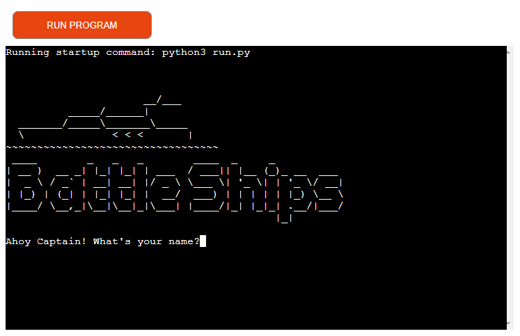

### About my Game

This is my command line Battle Ships game which allows the user to play against the computer by guessing it's fleets locations.

This game is run on the Code Institute mock terminal on heroku.

### How to Play

- Once the program is ran, the user can input their name and view the game instructions by typing "yes" in the terminal.
- The instructions inform the user of how to play the game.
- The user then chooses their difficulty (easy, medium or hard).
- The user then chooses their grid size, please note that the smallest size can be 3x3 and the largest 10x10.
- Once the user proceeds with desired grid size, they then start the game loop.
- The user first guesses the row location, then the column location.
- If its a hit, it is marked with "X", if its a miss it is marked with "M".
- Once the user has correctly guessed and sunk the enemies ships, they have won the game!
- If they miss and run out of turns, they lose and the game is over.

### Flow Chart


## Features

#### Button


- This is the button that is already displayed via the Code Institute template I was given, which allows the user to play the game.

#### Landing Screen


- Once the programme is ran, the user is greeted with a landing page which has an image of a battle ship with the name of the game printed out for the user to see.

#### Name Input

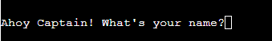

- The user is then prompted to input their name, the name the user gives is then also used throughout the game in different scenarios.
- There is also input validation on the name input so the user cannot just press enter.

#### Instructions

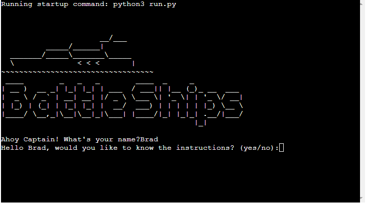

- The user is asked if they want to view the instructions, they have the option to press yes or no.
- This input has input validation on so the user either has to put "yes" or "no".

  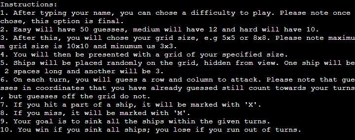

- If the user chooses to view the instructions, they are displayed as the above.
- The instructions tell the user how to play the game, and include the settings for the difficulty (e.g how many turns and that you cannot change once chose), the maximum and minimum grid sizes and also what counts towards the users turns.

#### Difficulty


- The user can chose what difficutly they want.
- This input has input validation on so the user can only type "easy", "medium" or "hard".
- The settings for each difficulty are explained in the instructions.
- Once the user has chose their difficulty, they cannot change unless they restart the programme.

#### Board Size

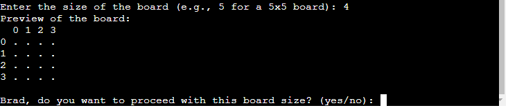

- The user has the option to chose their own grid size.
- This input also has input validation on.
- The prompt explains what format they must type it in, e.g 5 for a 5x5 grid.

#### Preview Board Size


- Once the user has chose, they can preview the board size and chose whether they want to continue or not.
- This input has input validation on, so the user can only type "yes" or "no".
- If the user does not like the board size, they are able to to type "no" and chose another size until satisfied.

#### Game Start


- When the user starts the game, they are greeted with "Let's play Battleships!" and their grid.
- At the top of the grid is the users turns and along the top and left hand side are the col and row numbers.

#### Row and Column Guess

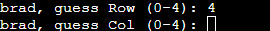

- The user is then promted to input their row and column guesses.
- These inputs have input validation applied so they can only input valid integers.
- Please see below message for invalid input:

  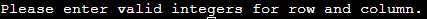

#### Hit and Miss

- When the user hits the ship, it is marked with "X", and the below message appears:

  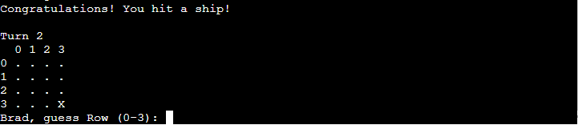

- Once the user has sunk a ship, either size 2 or 3 - the below messages appear:

  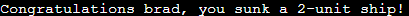

  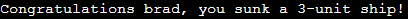

- Also, as the user sinks the ships, the below messages appear telling them how many remain:

  

  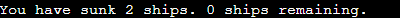

- When the user misses or guesses a location they have already guessed, the below messages appear:

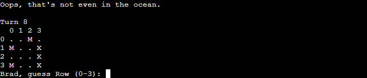

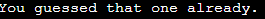

#### Game Over

- If the user guesses the enemy fleets locations correctly, they will be greeted with the below ending:

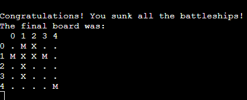

- If they lose and run out of turns, they will be greeted with the below ending:

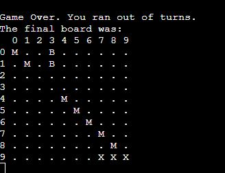

- Both of these images show an image of the final board.
- The final board shows where the boats ("B") were if you missed, or where your hits ("X") were if you won.
- They show all missed ("M") guesses as well.

## Data Model

#### Functions

- Functions are used to handle various aspects of gameplay.
- Functions are used to set up the game, manage user interactions, update the game state, and ensure logical progression from start to finish.
- This modular approach allows for organized and maintainable code, making it easier to manage the game's logic and flow.

#### Variables

- Variables are used to store essential data such as the game board, ship positions, player settings, and current game state.
- They are used to keep track of player inputs, game configurations, and the status of the board, such as which cells have been guessed and the results of those guesses.

#### Loops

- Loops are used for managing repetitive tasks within the game, such as placing ships, capturing user input, and iterating through turns.
- They allow the game to continually prompt the player for actions, validate inputs, and update the game state until a termination condition is met (e.g., all ships are sunk or the player runs out of turns).
- Loops enable continuous interaction and ensure a smooth and responsive gameplay experience.

## Wireframe

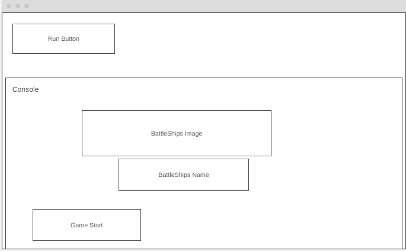

- The above image is my wireframe which I completed before starting my project.
- As this is a command line project there wasn't much to do in terms of styling however I still kept to the loading image and name in the final game.

## User Story

| Story No. | Story                                                                                                                                                                     |
| --------- | ------------------------------------------------------------------------------------------------------------------------------------------------------------------------- |
| 1         | As a user, <br> I want to be able to change the size of the grid <br> each time I play to add variety. <br><br>I know I am done when I have changed the grid size         |
| 2         | As a user, <br> I want to be able to change the difficulty of the game <br> to better test my skill. <br><br>I know I am done when I have changed the difficulty          |
| 3         | As a user, <br> I want to be able to track how many ships I have sunk <br> to see how well I am doing. <br><br>I know I am done when I can see how many ships I have sunk |
| 4         | As a user, <br> I want to be able to set my name for the game <br> to help me feel more immersed. <br><br>I know I am done when I have set my name                        |

## Future Improvements

- A feature I would like to add in the future would be using excel sheets / APIs to store players scores so they can track their high scores.
- Another feature would be to add color using different APIs to add a bit more realism to the game.

## Testing

### Validator Testing

#### PEP8 Results

- I used the [Code Institute PEP8](https://pep8ci.herokuapp.com/#) code checker for checking my code.
- No errors were produced, please see below image:

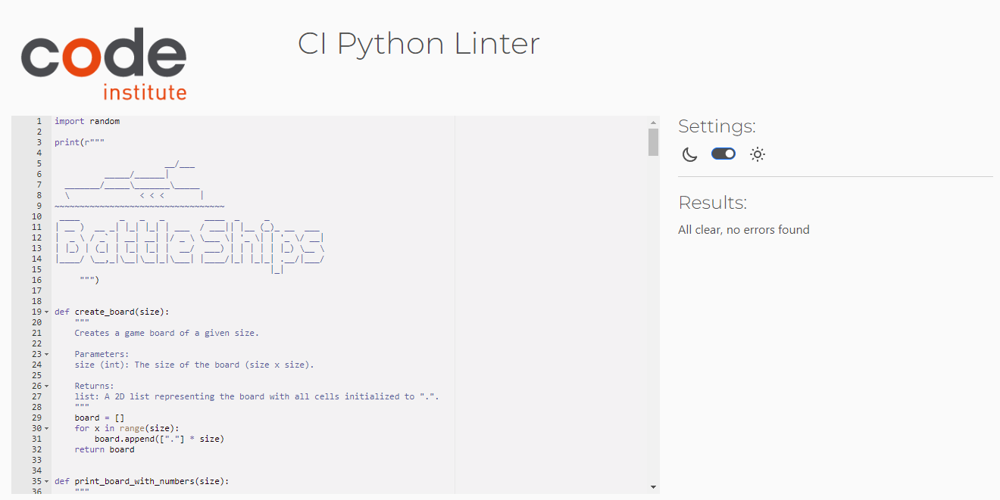

#### Manual Testing

- I tested my game thoroughly, testing all types of user inputs and stress testing it to find any issues.
- All inputs work correclty and all invalid data inputs are handled correclty with no errors or crashing.
- Testing was done both on my local terminal and the terminal hosted on the Code Institute Heroku Terminal.
- Whenever a user inputs invalid data, the below messages appear prompting them to input the data in the correct format:

- Invalid name entry:

  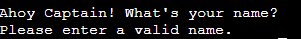

- Invalid difficulty entry:

  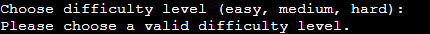

- Invalid board size entry:

  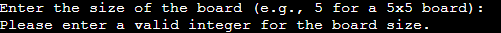

  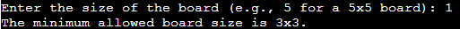

  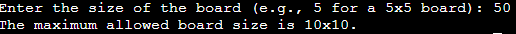

- Invalid preview board entry:

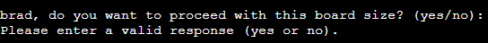

- Invalid row / column entry:

  

### User Story Testing

| Story No. | Result    | Story/ Evidence                                                                                                                                                                                                                                                                                                                                                                                                       |
| --------- | --------- | --------------------------------------------------------------------------------------------------------------------------------------------------------------------------------------------------------------------------------------------------------------------------------------------------------------------------------------------------------------------------------------------------------------------- |
| 1         | Test Pass | As a user, <br> I want to be able to change the size of the grid <br> each time I play to add variety. <br><br>I know I am done when I have changed the grid size <br><br>Evidence:<br>The user can enter the size of their desired grid each time they play.<br>                                                                                                       |
| 2         | Test Pass | As a user, <br> I want to be able to change the difficulty of the game <br> to better test my skill. <br><br>I know I am done when I have changed the difficulty <br><br>Evidence:<br>The user can change the difficulty each time they play.<br> 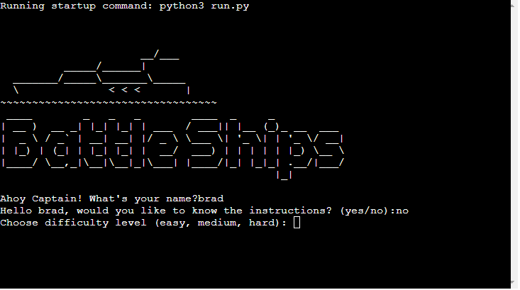                                                                                                            |
| 3         | Test Pass | As a user, <br> I want to be able to track how many ships I have sunk <br> to see how well I am doing. <br><br>I know I am done when I can see how many ships I have sunk <br><br>Evidence:<br>Once the user has sunk a ship, the text below will appear letting them know they have sunk a ship<br> <br> |
| 4         | Test Pass | As a user, <br> I want to be able to set my name for the game <br> to help me feel more immersed. <br><br>I know I am done when I have set my name <br><br>Evidence:<br>The user can enter their name at the start of each game.<br>                                                                                                                                      |

### Solved Bugs

#### Infinity

- I had originally set the number of turns for easy to infinity, however this caused problems when using "easy" in the range() function.
- To fix this I set the turns of easy to 50, a high number of turns which was unlikely to be reached and this fixed the issue.

#### Ships Sunk Error

- After sinking the first ship, the game would crash and produce the below error message:<br>"Traceback (most recent call last):
  File "C:\Users\brad*\BattleShips\BattleShips\run.py", line 247, in <module>
  play_game()
  File "C:\Users\brad*\BattleShips\BattleShips\run.py", line 220, in play_game
  ships_sunk[ship_length] += 1
  TypeError: 'bool' object is not subscriptable"
- To fix this I did the below change:

- Before:

```python
ships_sunk[ship_length] += 1
```

- After:

```python
ships_sunk[length] += 1
```

## Deployment

### Cloning & Forking

#### Fork

1. On GitHub.com, navigate to the [Brad-Hammond/BattleShips](https://github.com/Brad-Hammond/BattleShips) repository.
2. In the top-right corner of the page, click Fork.
3. By default, forks are named the same as their parent repositories. You can change the name of the fork to distinguish it further.
4. Add a description to your fork.
5. Click Create fork.

#### Clone

1. Above the list of files click the button that says 'Code'.
2. Copy the URL for the repository.
3. Open Terminal. Change the directory to the location where you want the cloned directory.
4. Type git clone, and then paste the URL
5. Press Enter.

### Local Deployment

1. Sign up to [Gitpod](https://gitpod.io/)
2. Download the Gitpod browser extension.
3. On GitHub.com, navigate to the [Brad-Hammond/BattleShips](https://github.com/Brad-Hammond/BattleShips) repository.
4. Above the list of files click the button that says 'Gitpod'.
5. Once open you will need to install the libraries, you can do this by typing "pip3 install -r requirements.txt" into the terminal

### Remote Deployment

The program was deployed to Heroku. If you have forked/cloned the repository the steps to deploy are:

1.  On Heroku, create a new app.
2.  input a name for your app
3.  Click on the settings tab
4.  Scroll to the Config Vars and click on the "Reveal Config Vars"
5.  Add another config, PORT into key and 8000 into value.
6.  Set the buildbacks to Python and NodeJs in that order .
7.  Link your Heroku app to you repository.
8.  Click on Deploy.
9.  The page will then provide the url to the python terminal.

## Credits / Acknowledgement

- Code institute for the deployment terminal -
  https://codeinstitute.net/

- This helped me to design my flow charts and class diagrams -
  https://lucid.app/

- ASCII Art Archive for the boat text-image and BattleShip logo -
  https://www.asciiart.eu/vehicles/boats
